# Sensor Simulation Diagrams and Screenshots

## Overview

This document describes the diagrams and screenshots that should be included in the sensor simulation chapter to enhance learning and understanding. These visual aids provide clarity to complex concepts and help learners visualize the setup and configuration processes for LiDAR, depth camera, and IMU sensors in digital twin applications.

## Required Diagrams and Screenshots

### 1. Multi-Sensor Robot Architecture Diagram
**Location**: Early in the sensor simulation chapter
**Purpose**: Show the complete multi-sensor robot configuration
**Content**:
- Base robot platform with LiDAR, depth camera, and IMU positions
- Sensor mounting points and orientations
- Data flow between sensors and processing units
- Coordinate frame relationships

```mermaid
graph TB
    subgraph "Robot Platform"
        A[Base Chassis] --> B[LiDAR Mount]
        A --> C[Camera Mount]
        A --> D[IMU Mount]
    end

    subgraph "Sensors"
        B --> E[360° LiDAR]
        C --> F[RGB-D Camera]
        D --> G[3-axis IMU]
    end

    subgraph "Gazebo Simulation"
        E --> H[LaserScan Topic]
        F --> I[Image Topics]
        G --> J[IMU Topic]
    end

    subgraph "ROS Processing"
        H --> K[Scan Processing]
        I --> L[Image Processing]
        J --> M[IMU Processing]
        K --> N[Sensor Fusion]
        L --> N
        M --> N
    end
```

### 2. LiDAR Sensor Configuration Screenshot
**Location**: In the LiDAR simulation section
**Purpose**: Show the Gazebo LiDAR sensor configuration in URDF/XACRO
**Content**:
- URDF code showing LiDAR sensor definition
- Parameter configuration (range, resolution, noise)
- Gazebo plugin settings
- Visual representation of LiDAR beam pattern

### 3. Depth Camera Sensor Setup Diagram
**Location**: In the depth camera simulation section
**Purpose**: Illustrate the depth camera sensor components and data flow
**Content**:
- RGB camera and depth sensor components
- Intrinsic and extrinsic calibration parameters
- RGB and depth image generation
- Point cloud creation process

### 4. IMU Sensor Configuration Interface Screenshot
**Location**: In the IMU simulation section
**Purpose**: Show the IMU sensor configuration parameters
**Content**:
- IMU sensor definition in URDF
- Noise and bias parameter settings
- Angular velocity and linear acceleration configuration
- Output topic configuration

### 5. Multi-Sensor Data Flow Diagram
**Location**: In the sensor data processing section
**Purpose**: Show how data flows between different sensors and processing nodes
**Content**:
- Sensor publishers and subscribers
- Message synchronization processes
- Processing pipelines for each sensor type
- Fusion algorithm integration points

### 6. Sensor Fusion Architecture Screenshot
**Location**: In the sensor fusion section
**Purpose**: Show the ROS node architecture for sensor fusion
**Content**:
- Multiple sensor subscribers
- Synchronization mechanisms
- Processing algorithms
- Output publishers

### 7. Performance Monitoring Screenshot
**Location**: In the performance optimization section
**Purpose**: Show tools for monitoring sensor performance
**Content**:
- ROS topic monitoring tools
- Performance statistics display
- CPU/GPU usage for sensor processing
- Update rate monitoring

### 8. Exercise Setup Screenshot
**Location**: In the hands-on exercise
**Purpose**: Show the completed multi-sensor robot setup
**Content**:
- Gazebo simulation view with robot
- RViz visualization with all sensor data
- Terminal showing active ROS nodes
- Sensor data streams visible

## Technical Requirements for Diagrams

### Format Specifications
- **Vector Diagrams**: SVG format for scalability and clarity
- **Screenshots**: PNG format with minimum 1920x1080 resolution
- **Color Scheme**: Consistent with documentation theme
- **Annotations**: Clear labels and callouts explaining key elements
- **Accessibility**: Alt text describing each visual element

### Content Guidelines
- **Clarity**: Focus on the key concept being explained
- **Simplicity**: Avoid clutter and unnecessary details
- **Consistency**: Use consistent visual styles throughout
- **Accuracy**: Represent actual software interfaces correctly
- **Relevance**: Each visual should directly support learning objectives

## Implementation Notes

### For Developers
When creating these diagrams and screenshots:
1. Use consistent color schemes and fonts
2. Ensure high contrast for readability
3. Include proper licensing information for any tools used
4. Test visual aids on different screen sizes and resolutions
5. Provide alternative text descriptions

### For Content Reviewers
When reviewing visual aids:
1. Verify that visuals support the text content
2. Check that all diagrams are accurate and up-to-date
3. Ensure accessibility standards are met
4. Confirm that visuals enhance rather than distract from learning
5. Validate that all required visuals are included

## Suggested Tools for Diagram Creation

### Diagram Tools
- **draw.io**: Free, web-based diagram tool with export to SVG
- **Lucidchart**: Professional diagramming with collaboration features
- **Inkscape**: Open-source vector graphics editor
- **Graphviz**: For automated graph layout
- **Mermaid**: For simple flowcharts (as shown in this document)

### Screenshot Tools
- **Gazebo built-in screenshot**: For simulation views
- **RViz screenshot**: For visualization displays
- **Terminal screenshots**: For command-line interfaces
- **ROS tools**: For topic and node visualizations

### Annotation Tools
- **GIMP**: Open-source image editor for annotations
- **Inkscape**: For adding text and arrows to diagrams
- **Snipping Tool/Screenshot**: Built-in OS tools for capturing

## Quality Assurance Checklist

### Review Checklist
- [ ] All required diagrams and screenshots are included
- [ ] Visual aids are properly positioned in the content
- [ ] Images are high quality and clearly visible
- [ ] Alternative text is provided for accessibility
- [ ] Visuals are properly licensed
- [ ] File sizes are optimized for web delivery

### Specific Screenshot Requirements

#### Gazebo Sensor Configuration Screenshots
1. **Model Editor View**: Show the sensor configuration panel in Gazebo
2. **URDF Code Editor**: Show the sensor definition in URDF/XACRO files
3. **Plugin Parameters**: Show the detailed plugin configuration settings
4. **Simulation View**: Show the robot with sensors in the Gazebo environment

#### ROS Tool Screenshots
1. **rqt_graph**: Show the node and topic connections
2. **rviz**: Show sensor data visualization
3. **rostopic echo**: Show raw sensor message output
4. **roslaunch**: Show the launch file execution

#### Processing Pipeline Screenshots
1. **Code Editor**: Show sensor processing algorithms
2. **Terminal Output**: Show processing node logs and statistics
3. **Performance Tools**: Show CPU/memory usage during processing
4. **Validation Results**: Show sensor accuracy and quality metrics

## Best Practices for Visual Creation

### Screenshot Quality
- Use high resolution settings when capturing
- Ensure UI elements are clearly visible
- Capture both default and active states
- Include multiple angles when showing 3D objects
- Use consistent lighting and contrast

### Diagram Clarity
- Use consistent icon styles and colors
- Maintain proper spacing between elements
- Use arrows and lines to indicate relationships
- Include legends when multiple colors/types are used
- Keep text readable at standard display sizes

### Accessibility
- Provide detailed alt text for all images
- Use high contrast color schemes
- Include text descriptions for complex diagrams
- Consider colorblind-friendly color palettes
- Ensure text is large enough to read easily

## Integration with Chapter Content

### LiDAR Simulation Section
- Include beam pattern diagrams showing field of view
- Show point cloud generation process
- Illustrate noise model parameters
- Demonstrate filtering techniques

### Depth Camera Simulation Section
- Show projection geometry and camera parameters
- Illustrate RGB-D data fusion
- Demonstrate point cloud creation
- Show distortion correction process

### IMU Simulation Section
- Illustrate 3-axis measurement setup
- Show coordinate frame relationships
- Demonstrate bias and drift modeling
- Explain orientation estimation

### Sensor Fusion Section
- Show data association concepts
- Illustrate Kalman filter processes
- Demonstrate multi-sensor integration
- Explain coordinate frame transformations

## Next Steps

With the visual aid requirements documented, the next step is to create the actual diagrams and screenshots following these specifications. The visual aids should be integrated into the appropriate sections of the chapter to enhance the learning experience.

Once created, these visual aids will significantly improve the comprehension of complex concepts in sensor simulation and digital twin implementation, providing learners with clear visual references for the configuration and processing of multi-sensor systems.

## Additional Resources

### For Creating Technical Diagrams
- **draw.io Templates**: Use technical and network diagram templates
- **ROS Visualization**: Leverage rqt and other ROS visualization tools
- **Gazebo Screenshots**: Use the built-in screenshot functionality
- **Camera Angles**: Use multiple views (top, side, perspective) for 3D content

### For Consistent Styling
- **Color Palette**: Use documentation theme colors
- **Typography**: Maintain consistent font sizes and styles
- **Layout**: Follow grid-based design principles
- **Icons**: Use consistent icon sets throughout