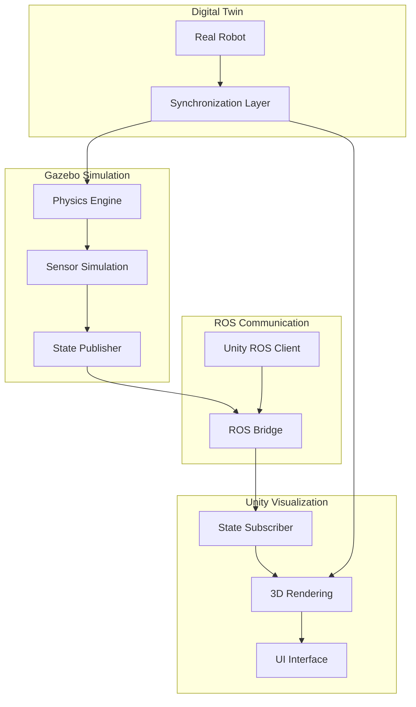

# Integration Guide - Connecting Gazebo and Unity

## Overview

This guide provides comprehensive instructions for connecting Gazebo physics simulation with Unity visualization to create a complete digital twin system. The integration allows real-time synchronization between the physical simulation in Gazebo and the visual representation in Unity, enabling accurate digital twin applications.

## Learning Objectives

After completing this guide, you will be able to:
- Set up communication between Gazebo and Unity environments
- Synchronize robot states between simulation engines
- Implement real-time data exchange for digital twin applications
- Validate the integration for accuracy and performance
- Troubleshoot common integration issues

## Prerequisites

- Completed Chapter 1 (Gazebo Physics Simulation)
- Completed Chapter 2 (Unity Visualization)
- Completed Chapter 3 (Sensor Simulation)
- Basic understanding of ROS networking
- Unity with Robotics packages installed
- Gazebo with ROS plugins configured

## Architecture Overview

The Gazebo-Unity integration follows a client-server architecture where:
- **Gazebo** serves as the physics and sensor simulation server
- **Unity** acts as the visualization and rendering client
- **ROS** provides the communication middleware
- **Custom bridges** handle real-time state synchronization



## Setting Up the Communication Bridge

### ROS Network Configuration

First, configure ROS networking to enable communication between Gazebo and Unity:

```bash
# Terminal 1: Start ROS master
export ROS_MASTER_URI=http://localhost:11311
export ROS_HOSTNAME=localhost
roscore

# Terminal 2: Set up ROS_IP for network communication
export ROS_IP=127.0.0.1
export ROS_MASTER_URI=http://localhost:11311
```

### Unity ROS TCP Connector Setup

In Unity, configure the ROS TCP Connector:

```csharp
using System.Collections;
using System.Collections.Generic;
using UnityEngine;
using RosSharp.RosBridgeClient;

public class GazeboUnityBridge : MonoBehaviour
{
    [Header("ROS Connection")]
    public string rosBridgeServerUrl = "ws://127.0.0.1:9090";

    [Header("Robot Configuration")]
    public string robotName = "multi_sensor_robot";
    public string jointStateTopic = "/joint_states";
    public string tfTopic = "/tf";

    [Header("Synchronization Settings")]
    public float updateRate = 60f; // Hz
    public bool enablePhysicsSync = true;
    public bool enableSensorSync = true;

    private RosSocket rosSocket;
    private JointStateSubscriber jointStateSubscriber;
    private TransformSync transformSync;

    void Start()
    {
        ConnectToRosBridge();
    }

    private void ConnectToRosBridge()
    {
        RosBridgeClient.Protocols.WebSocketNetProtocol protocol =
            new RosBridgeClient.Protocols.WebSocketNetProtocol(rosBridgeServerUrl);

        rosSocket = new RosSocket(protocol);

        // Subscribe to joint states from Gazebo
        jointStateSubscriber = new JointStateSubscriber(rosSocket, jointStateTopic, OnJointStateReceived);

        // Set up transform synchronization
        transformSync = new TransformSync(rosSocket, tfTopic, robotName);

        Debug.Log($"Connected to ROS Bridge at {rosBridgeServerUrl}");
    }

    private void OnJointStateReceived(JointState jointState)
    {
        if (enablePhysicsSync)
        {
            // Update Unity robot model based on Gazebo joint states
            UpdateRobotJoints(jointState);
        }
    }

    private void UpdateRobotJoints(JointState jointState)
    {
        // Update each joint in the Unity robot model
        for (int i = 0; i < jointState.name.Count; i++)
        {
            string jointName = jointState.name[i];
            float jointPosition = jointState.position[i];

            Transform jointTransform = FindJointByName(jointName);
            if (jointTransform != null)
            {
                // Update joint position/rotation based on joint type
                UpdateJointTransform(jointTransform, jointPosition);
            }
        }
    }

    private Transform FindJointByName(string name)
    {
        // Search for joint in the robot hierarchy
        Transform[] allChildren = GetComponentsInChildren<Transform>();
        foreach (Transform child in allChildren)
        {
            if (child.name == name)
                return child;
        }
        return null;
    }

    private void UpdateJointTransform(Transform joint, float position)
    {
        // Update the joint based on its type (revolute, prismatic, etc.)
        // This is a simplified example - in practice, you'd have different update methods
        // based on the joint type from the URDF
        joint.localRotation = Quaternion.Euler(0, position * Mathf.Rad2Deg, 0);
    }

    void OnDestroy()
    {
        if (rosSocket != null)
        {
            rosSocket.Close();
        }
    }
}
```

## Gazebo Configuration for Integration

### Robot State Publisher Setup

Configure Gazebo to publish robot states that Unity can consume:

```xml
<!-- In your robot's URDF/XACRO file -->
<robot xmlns:xacro="http://www.ros.org/wiki/xacro" name="multi_sensor_robot">
  <!-- Robot state publisher configuration -->
  <gazebo>
    <plugin name="robot_state_publisher" filename="libgazebo_ros_joint_state_publisher.so">
      <jointName>joint_states</jointName>
      <updateRate>60.0</updateRate>
      <alwaysOn>true</alwaysOn>
    </plugin>
  </gazebo>

  <!-- Joint state publisher -->
  <gazebo>
    <plugin name="joint_state_publisher" filename="libgazebo_ros_joint_state_publisher.so">
      <updateRate>60.0</updateRate>
      <jointName>front_left_wheel_joint, front_right_wheel_joint, back_left_wheel_joint, back_right_wheel_joint</jointName>
    </plugin>
  </gazebo>
</robot>
```

### TF Publisher Configuration

Set up TF publishers to provide coordinate transformations:

```xml
<!-- In your launch file -->
<launch>
  <!-- Robot state publisher -->
  <node name="robot_state_publisher" pkg="robot_state_publisher" type="robot_state_publisher" />

  <!-- Joint state publisher -->
  <node name="joint_state_publisher" pkg="joint_state_publisher" type="joint_state_publisher">
    <param name="use_gui" value="false" />
    <rosparam param="source_list">[joint_states]</rosparam>
  </node>

  <!-- Static transform publishers for sensor frames -->
  <node pkg="tf" type="static_transform_publisher" name="lidar_broadcaster"
        args="0.0 0.0 0.15 0 0 0 base_link lidar_link 100" />
  <node pkg="tf" type="static_transform_publisher" name="camera_broadcaster"
        args="0.1 0.0 0.1 0 0 0 base_link camera_link 100" />
  <node pkg="tf" type="static_transform_publisher" name="imu_broadcaster"
        args="0.0 0.0 0.05 0 0 0 base_link imu_link 100" />
</launch>
```

## Real-Time Synchronization Implementation

### State Synchronization Node

Create a ROS node that ensures real-time synchronization:

```cpp
#include <ros/ros.h>
#include <sensor_msgs/JointState.h>
#include <tf/transform_broadcaster.h>
#include <nav_msgs/Odometry.h>
#include <geometry_msgs/PoseStamped.h>
#include <std_msgs/Float32MultiArray.h>

class GazeboUnitySynchronizer {
public:
    GazeboUnitySynchronizer(ros::NodeHandle& nh) : nh_(nh) {
        // Subscribers
        joint_state_sub_ = nh_.subscribe("/joint_states", 100,
                                       &GazeboUnitySynchronizer::jointStateCallback, this);
        odom_sub_ = nh_.subscribe("/odom", 100,
                                 &GazeboUnitySynchronizer::odometryCallback, this);

        // Publishers for Unity
        unity_joint_pub_ = nh_.advertise<sensor_msgs::JointState>("/unity/joint_states", 100);
        unity_pose_pub_ = nh_.advertise<geometry_msgs::PoseStamped>("/unity/robot_pose", 100);
        unity_sync_pub_ = nh_.advertise<std_msgs::Float32MultiArray>("/unity/sync_status", 10);

        // Timer for synchronization
        sync_timer_ = nh_.createTimer(ros::Duration(1.0/60.0), // 60 Hz
                                     &GazeboUnitySynchronizer::synchronizationLoop, this);

        ROS_INFO("Gazebo-Unity Synchronizer initialized");
    }

private:
    ros::NodeHandle& nh_;
    ros::Subscriber joint_state_sub_, odom_sub_;
    ros::Publisher unity_joint_pub_, unity_pose_pub_, unity_sync_pub_;
    ros::Timer sync_timer_;

    sensor_msgs::JointState latest_joint_state_;
    nav_msgs::Odometry latest_odom_;
    bool joint_state_received_ = false;
    bool odom_received_ = false;

    void jointStateCallback(const sensor_msgs::JointState::ConstPtr& msg) {
        latest_joint_state_ = *msg;
        joint_state_received_ = true;
    }

    void odometryCallback(const nav_msgs::Odometry::ConstPtr& msg) {
        latest_odom_ = *msg;
        odom_received_ = true;
    }

    void synchronizationLoop(const ros::TimerEvent& event) {
        if (joint_state_received_ && odom_received_) {
            // Publish synchronized data to Unity
            publishToUnity();

            // Check synchronization quality
            checkSynchronizationQuality();
        }
    }

    void publishToUnity() {
        // Publish joint states to Unity
        unity_joint_pub_.publish(latest_joint_state_);

        // Publish robot pose to Unity
        geometry_msgs::PoseStamped pose_msg;
        pose_msg.header = latest_odom_.header;
        pose_msg.header.frame_id = "map";
        pose_msg.pose = latest_odom_.pose.pose;
        unity_pose_pub_.publish(pose_msg);

        // Publish synchronization status
        std_msgs::Float32MultiArray sync_status;
        sync_status.data.push_back(1.0); // Sync status (1.0 = good, 0.0 = poor)
        sync_status.data.push_back(ros::Time::now().toSec()); // Timestamp
        unity_sync_pub_.publish(sync_status);
    }

    void checkSynchronizationQuality() {
        // Calculate time difference between Gazebo and Unity updates
        ros::Time now = ros::Time::now();

        // Check if data is too old (indicating sync issues)
        double joint_age = (now - latest_joint_state_.header.stamp).toSec();
        double odom_age = (now - latest_odom_.header.stamp).toSec();

        if (joint_age > 0.1 || odom_age > 0.1) { // More than 100ms old
            ROS_WARN_THROTTLE(1.0, "Synchronization delay detected: Joint age=%.3f, Odom age=%.3f",
                             joint_age, odom_age);
        }
    }
};
```

### Unity Synchronization Script

Create a Unity script to handle incoming synchronization data:

```csharp
using System.Collections;
using System.Collections.Generic;
using UnityEngine;
using RosSharp.RosBridgeClient;
using RosSharp.Messages.Sensor_msgs;
using RosSharp.Messages.Geometry_msgs;
using RosSharp.Messages.Nav_msgs;

public class UnityGazeboSynchronizer : MonoBehaviour
{
    [Header("Synchronization Settings")]
    public float maxSyncDelay = 0.1f; // Maximum acceptable delay in seconds
    public bool enableInterpolation = true;
    public AnimationCurve syncQualityCurve;

    [Header("Performance Settings")]
    public int maxInterpolationFrames = 5;
    public float interpolationRate = 60f; // Hz

    private Dictionary<string, float> targetJointPositions = new Dictionary<string, float>();
    private Dictionary<string, float> currentJointPositions = new Dictionary<string, float>();
    private Vector3 targetPosition;
    private Quaternion targetRotation;
    private Vector3 currentPosition;
    private Quaternion currentRotation;

    private float lastSyncTime;
    private bool isSynchronized = false;

    private RosSocket rosSocket;
    private JointStateSubscriber jointStateSubscriber;
    private PoseSubscriber poseSubscriber;

    void Start()
    {
        InitializeSynchronization();
    }

    private void InitializeSynchronization()
    {
        // Initialize joint position dictionaries
        InitializeJointPositions();

        // Set up ROS subscribers
        SetupRosSubscribers();

        lastSyncTime = Time.time;

        Debug.Log("Unity-Gazebo Synchronization initialized");
    }

    private void InitializeJointPositions()
    {
        // Initialize all joints to zero position
        Transform[] allChildren = GetComponentsInChildren<Transform>();
        foreach (Transform child in allChildren)
        {
            if (child.name.Contains("joint") || child.name.Contains("Joint"))
            {
                targetJointPositions[child.name] = 0f;
                currentJointPositions[child.name] = 0f;
            }
        }
    }

    private void SetupRosSubscribers()
    {
        // Set up ROS connection and subscribers
        RosBridgeClient.Protocols.WebSocketNetProtocol protocol =
            new RosBridgeClient.Protocols.WebSocketNetProtocol("ws://127.0.0.1:9090");

        rosSocket = new RosSocket(protocol);

        // Subscribe to joint states from Gazebo
        jointStateSubscriber = new JointStateSubscriber(rosSocket, "/unity/joint_states", OnJointStateReceived);

        // Subscribe to pose updates
        poseSubscriber = new PoseSubscriber(rosSocket, "/unity/robot_pose", OnPoseReceived);
    }

    private void OnJointStateReceived(JointState jointState)
    {
        // Update target joint positions from Gazebo
        for (int i = 0; i < jointState.name.Count; i++)
        {
            string jointName = jointState.name[i];
            float jointPosition = jointState.position[i];

            if (targetJointPositions.ContainsKey(jointName))
            {
                targetJointPositions[jointName] = jointPosition;
            }
        }

        lastSyncTime = Time.time;
        isSynchronized = true;
    }

    private void OnPoseReceived(Pose pose)
    {
        // Update target position and rotation
        targetPosition = new Vector3((float)pose.position.x, (float)pose.position.y, (float)pose.position.z);
        targetRotation = new Quaternion((float)pose.orientation.x, (float)pose.orientation.y,
                                       (float)pose.orientation.z, (float)pose.orientation.w);
    }

    void Update()
    {
        if (isSynchronized)
        {
            SynchronizeRobotState();
            CheckSynchronizationQuality();
        }
    }

    private void SynchronizeRobotState()
    {
        if (enableInterpolation)
        {
            // Interpolate to target positions over time
            float deltaTime = Time.deltaTime;

            // Update robot position and rotation
            transform.position = Vector3.Lerp(transform.position, targetPosition, deltaTime * interpolationRate);
            transform.rotation = Quaternion.Slerp(transform.rotation, targetRotation, deltaTime * interpolationRate);

            // Update joint positions with interpolation
            foreach (var joint in targetJointPositions)
            {
                if (currentJointPositions.ContainsKey(joint.Key))
                {
                    float currentPos = currentJointPositions[joint.Key];
                    float targetPos = joint.Value;

                    // Interpolate to target position
                    float newPos = Mathf.Lerp(currentPos, targetPos, deltaTime * interpolationRate);
                    currentJointPositions[joint.Key] = newPos;

                    // Apply the new position to the joint
                    UpdateJointInHierarchy(joint.Key, newPos);
                }
            }
        }
        else
        {
            // Direct update without interpolation
            transform.position = targetPosition;
            transform.rotation = targetRotation;

            foreach (var joint in targetJointPositions)
            {
                currentJointPositions[joint.Key] = joint.Value;
                UpdateJointInHierarchy(joint.Key, joint.Value);
            }
        }
    }

    private void UpdateJointInHierarchy(string jointName, float position)
    {
        Transform jointTransform = FindJointByName(jointName);
        if (jointTransform != null)
        {
            // Update the joint based on its type
            // This is a simplified example - in practice, you'd have different methods
            // for different joint types (revolute, prismatic, etc.)
            jointTransform.localRotation = Quaternion.Euler(0, position * Mathf.Rad2Deg, 0);
        }
    }

    private Transform FindJointByName(string name)
    {
        Transform[] allChildren = GetComponentsInChildren<Transform>();
        foreach (Transform child in allChildren)
        {
            if (child.name == name)
                return child;
        }
        return null;
    }

    private void CheckSynchronizationQuality()
    {
        float currentTime = Time.time;
        float syncDelay = currentTime - lastSyncTime;

        if (syncDelay > maxSyncDelay)
        {
            Debug.LogWarning($"Synchronization delay detected: {syncDelay:F3}s");
            isSynchronized = false;
        }

        // Calculate and display sync quality
        float syncQuality = Mathf.Clamp01(1.0f - (syncDelay / maxSyncDelay));
        float qualityCurveValue = syncQualityCurve.Evaluate(syncQuality);

        // You can use this quality value to adjust rendering quality or warn the user
        if (qualityCurveValue < 0.5f)
        {
            Debug.Log("Synchronization quality is degraded");
        }
    }

    void OnDestroy()
    {
        if (rosSocket != null)
        {
            rosSocket.Close();
        }
    }
}
```

## Performance Optimization

### Network Optimization

Optimize network communication for real-time performance:

```python
#!/usr/bin/env python3

import rospy
import numpy as np
from sensor_msgs.msg import JointState
from geometry_msgs.msg import PoseStamped
from std_msgs.msg import Float32MultiArray
import threading
import time

class OptimizedSyncNode:
    def __init__(self):
        rospy.init_node('optimized_sync_node')

        # Publishers with optimized queue sizes
        self.unity_joint_pub = rospy.Publisher('/unity/joint_states', JointState, queue_size=10)
        self.unity_pose_pub = rospy.Publisher('/unity/robot_pose', PoseStamped, queue_size=10)

        # Subscribers
        self.joint_sub = rospy.Subscriber('/joint_states', JointState, self.joint_callback, queue_size=10)
        self.odom_sub = rospy.Subscriber('/odom', Odometry, self.odom_callback, queue_size=10)

        # Threading for non-blocking operations
        self.data_lock = threading.RLock()
        self.joint_data = None
        self.odom_data = None

        # Optimization parameters
        self.sync_rate = 60  # Hz
        self.compression_enabled = True
        self.throttling_factor = 1  # Send every Nth message

        # Message counters for throttling
        self.msg_counter = 0

        # Start synchronization timer
        self.timer = rospy.Timer(rospy.Duration(1.0/self.sync_rate), self.sync_callback)

        rospy.loginfo("Optimized Synchronization Node initialized")

    def joint_callback(self, msg):
        with self.data_lock:
            self.joint_data = msg

    def odom_callback(self, msg):
        with self.data_lock:
            self.odom_data = msg

    def sync_callback(self, event):
        self.msg_counter += 1

        # Throttle messages based on factor
        if self.msg_counter % self.throttling_factor != 0:
            return

        with self.data_lock:
            if self.joint_data and self.odom_data:
                # Optimize joint state message
                optimized_joint_msg = self.optimize_joint_state(self.joint_data)
                self.unity_joint_pub.publish(optimized_joint_msg)

                # Optimize pose message
                optimized_pose_msg = self.optimize_pose(self.odom_data)
                self.unity_pose_pub.publish(optimized_pose_msg)

    def optimize_joint_state(self, joint_msg):
        """Optimize joint state message for network transmission"""
        # Only send joints that have changed significantly
        optimized_msg = JointState()
        optimized_msg.header = joint_msg.header

        # Threshold for sending joint updates (radians)
        threshold = 0.001

        for i, name in enumerate(joint_msg.name):
            if i < len(joint_msg.position):
                pos = joint_msg.position[i]

                # Only send if position has changed significantly
                if abs(pos) > threshold or len(optimized_msg.name) == 0:
                    optimized_msg.name.append(name)
                    optimized_msg.position.append(pos)

                    if i < len(joint_msg.velocity):
                        optimized_msg.velocity.append(joint_msg.velocity[i])
                    else:
                        optimized_msg.velocity.append(0.0)

                    if i < len(joint_msg.effort):
                        optimized_msg.effort.append(joint_msg.effort[i])
                    else:
                        optimized_msg.effort.append(0.0)

        return optimized_msg

    def optimize_pose(self, odom_msg):
        """Optimize pose message for network transmission"""
        pose_msg = PoseStamped()
        pose_msg.header = odom_msg.header
        pose_msg.header.frame_id = "map"

        # Reduce precision for network efficiency
        pose_msg.pose.position.x = round(odom_msg.pose.pose.position.x, 3)
        pose_msg.pose.position.y = round(odom_msg.pose.pose.position.y, 3)
        pose_msg.pose.position.z = round(odom_msg.pose.pose.position.z, 3)

        # For orientation, preserve quaternion properties
        pose_msg.pose.orientation = odom_msg.pose.pose.orientation

        return pose_msg

if __name__ == '__main__':
    try:
        node = OptimizedSyncNode()
        rospy.spin()
    except rospy.ROSInterruptException:
        pass
```

## Validation and Testing

### Integration Validation Script

Create a validation script to test the integration:

```python
#!/usr/bin/env python3

import rospy
import numpy as np
from sensor_msgs.msg import JointState
from geometry_msgs.msg import PoseStamped, Twist
from std_msgs.msg import Float32
import time
from collections import deque

class IntegrationValidator:
    def __init__(self):
        rospy.init_node('integration_validator')

        # Subscribers for both systems
        self.gazebo_joint_sub = rospy.Subscriber('/joint_states', JointState, self.gazebo_joint_callback)
        self.unity_joint_sub = rospy.Subscriber('/unity/joint_states', JointState, self.unity_joint_callback)
        self.gazebo_pose_sub = rospy.Subscriber('/odom', Odometry, self.gazebo_pose_callback)
        self.unity_pose_sub = rospy.Subscriber('/unity/robot_pose', PoseStamped, self.unity_pose_callback)

        # Publishers for validation results
        self.sync_quality_pub = rospy.Publisher('/integration/sync_quality', Float32, queue_size=10)
        self.error_pub = rospy.Publisher('/integration/position_error', Float32, queue_size=10)

        # Data storage
        self.gazebo_joint_history = deque(maxlen=100)
        self.unity_joint_history = deque(maxlen=100)
        self.gazebo_pose_history = deque(maxlen=100)
        self.unity_pose_history = deque(maxlen=100)

        # Validation parameters
        self.max_position_error = 0.05  # 5cm tolerance
        self.max_orientation_error = 0.1  # 0.1 rad tolerance
        self.max_joint_error = 0.01  # 0.01 rad tolerance

        # Validation timer
        self.validation_timer = rospy.Timer(rospy.Duration(1.0), self.validate_integration)

        rospy.loginfo("Integration Validator initialized")

    def gazebo_joint_callback(self, msg):
        self.gazebo_joint_history.append({
            'timestamp': rospy.Time.now(),
            'data': msg
        })

    def unity_joint_callback(self, msg):
        self.unity_joint_history.append({
            'timestamp': rospy.Time.now(),
            'data': msg
        })

    def gazebo_pose_callback(self, msg):
        self.gazebo_pose_history.append({
            'timestamp': rospy.Time.now(),
            'data': msg
        })

    def unity_pose_callback(self, msg):
        self.unity_pose_history.append({
            'timestamp': rospy.Time.now(),
            'data': msg
        })

    def validate_integration(self, event):
        """Validate synchronization between Gazebo and Unity"""
        if len(self.gazebo_joint_history) < 2 or len(self.unity_joint_history) < 2:
            rospy.loginfo_throttle(5.0, "Insufficient data for validation")
            return

        # Validate joint synchronization
        joint_error = self.validate_joint_sync()

        # Validate pose synchronization
        pose_error = self.validate_pose_sync()

        # Calculate overall sync quality
        max_error = max(joint_error, pose_error) if joint_error is not None and pose_error is not None else 0
        sync_quality = max(0.0, 1.0 - max_error)  # Quality decreases with error

        # Publish validation results
        self.sync_quality_pub.publish(Float32(sync_quality))
        self.error_pub.publish(Float32(max_error))

        # Log validation status
        if sync_quality > 0.9:
            status = "EXCELLENT"
        elif sync_quality > 0.7:
            status = "GOOD"
        elif sync_quality > 0.5:
            status = "FAIR"
        else:
            status = "POOR"

        rospy.loginfo_throttle(2.0, f"Integration Validation - Status: {status}, "
                         f"Sync Quality: {sync_quality:.3f}, Max Error: {max_error:.3f}")

    def validate_joint_sync(self):
        """Validate joint state synchronization"""
        if not self.gazebo_joint_history or not self.unity_joint_history:
            return None

        # Get latest data from both systems
        gazebo_data = self.gazebo_joint_history[-1]['data']
        unity_data = self.unity_joint_history[-1]['data']

        # Create dictionaries for easy comparison
        gazebo_joints = dict(zip(gazebo_data.name, gazebo_data.position))
        unity_joints = dict(zip(unity_data.name, unity_data.position))

        # Calculate maximum joint error
        max_error = 0
        common_joints = set(gazebo_joints.keys()) & set(unity_joints.keys())

        for joint_name in common_joints:
            gazebo_pos = gazebo_joints[joint_name]
            unity_pos = unity_joints[joint_name]
            error = abs(gazebo_pos - unity_pos)
            max_error = max(max_error, error)

        return max_error if common_joints else None

    def validate_pose_sync(self):
        """Validate pose synchronization"""
        if not self.gazebo_pose_history or not self.unity_pose_history:
            return None

        # Get latest data from both systems
        gazebo_data = self.gazebo_pose_history[-1]['data']
        unity_data = self.unity_pose_history[-1]['data']

        # Calculate position error
        gz_pos = np.array([gazebo_data.pose.pose.position.x,
                          gazebo_data.pose.pose.position.y,
                          gazebo_data.pose.pose.position.z])
        un_pos = np.array([unity_data.pose.position.x,
                          unity_data.pose.position.y,
                          unity_data.pose.position.z])

        pos_error = np.linalg.norm(gz_pos - un_pos)

        # Calculate orientation error
        gz_orient = np.array([gazebo_data.pose.pose.orientation.x,
                             gazebo_data.pose.pose.orientation.y,
                             gazebo_data.pose.pose.orientation.z,
                             gazebo_data.pose.pose.orientation.w])
        un_orient = np.array([unity_data.pose.orientation.x,
                             unity_data.pose.orientation.y,
                             unity_data.pose.orientation.z,
                             unity_data.pose.orientation.w])

        # Quaternion difference (simplified)
        orient_diff = 2 * np.arccos(abs(np.dot(gz_orient, un_orient)))

        # Combined error (weighted)
        combined_error = 0.7 * pos_error + 0.3 * orient_diff

        return combined_error

if __name__ == '__main__':
    try:
        validator = IntegrationValidator()
        rospy.spin()
    except rospy.ROSInterruptException:
        pass
```

## Troubleshooting Common Issues

### Connection Issues
- **Problem**: ROS bridge connection fails
  - **Solution**: Verify ROS master is running and check network configuration
  - **Command**: `rostopic list` to verify topics are available

- **Problem**: Unity cannot connect to ROS bridge
  - **Solution**: Check WebSocket server is running on correct port
  - **Command**: `netstat -an | grep 9090` to verify port availability

### Synchronization Issues
- **Problem**: Gazebo and Unity states are out of sync
  - **Solution**: Increase update rate or check for network latency
  - **Check**: Use the validation script to measure sync quality

- **Problem**: Joints not updating in Unity
  - **Solution**: Verify joint names match between URDF and Unity model
  - **Check**: Use `rostopic echo /joint_states` to verify data flow

### Performance Issues
- **Problem**: Low frame rate in Unity during synchronization
  - **Solution**: Reduce synchronization rate or optimize Unity rendering
  - **Adjust**: Lower `updateRate` in synchronization scripts

## Best Practices

### 1. Network Configuration
- Use dedicated network interface for Gazebo-Unity communication
- Configure appropriate QoS settings for real-time performance
- Monitor network bandwidth usage during operation

### 2. Data Optimization
- Only transmit necessary data at required frequency
- Implement data compression for large messages
- Use throttling to reduce network load

### 3. Error Handling
- Implement graceful degradation when sync is lost
- Provide visual feedback for synchronization status
- Log synchronization errors for debugging

### 4. Testing
- Test integration under various network conditions
- Validate synchronization accuracy with ground truth
- Monitor performance under different load conditions

## Next Steps

After successfully implementing the Gazebo-Unity integration:

1. **Complete Digital Twin Example**: Develop a full example combining all three chapters
2. **Cross-Chapter Exercises**: Create exercises that use the integrated system
3. **Performance Optimization**: Fine-tune the integration for your specific use case
4. **Real Robot Integration**: Extend the system to work with real robots

## Exercises

1. **Basic Integration Exercise**: Set up a simple robot model with joint synchronization between Gazebo and Unity.

2. **Advanced Integration Exercise**: Implement sensor data visualization in Unity based on Gazebo sensor simulation.

3. **Performance Exercise**: Optimize the integration for minimal latency and maximum synchronization accuracy.

4. **Validation Exercise**: Create additional validation metrics to ensure long-term synchronization stability.